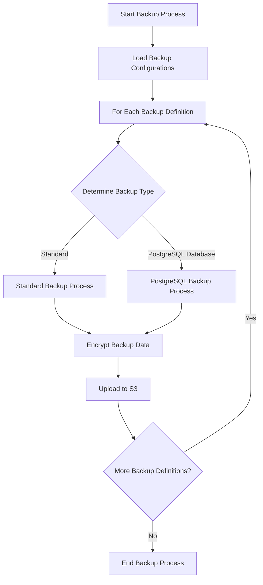
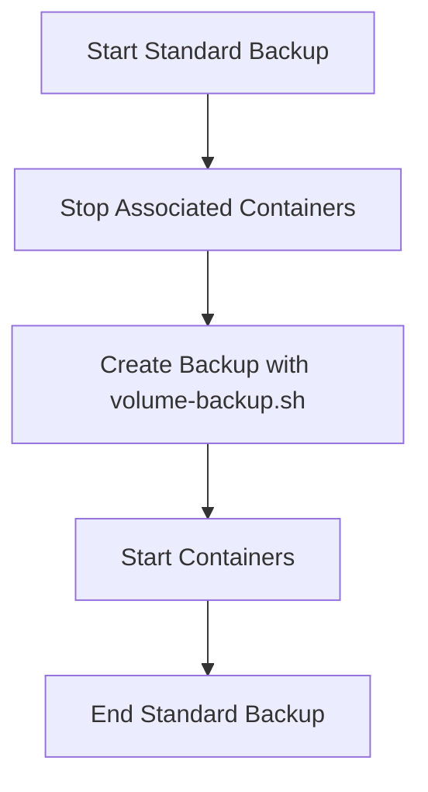
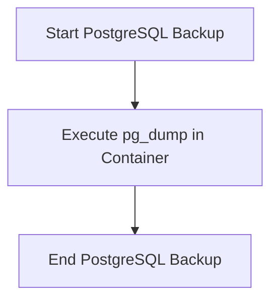

# Automated Backup Process Documentation

## Backup Configuration Structure

The backup configuration will be defined in a YAML file with the following structure:

```yaml
backupDefinitions:
  - name: "backup1"
    type: "standard"
    containers:
      - "container1"
      - "container2"
    volumes:
      - "volume1"
      - "volume2"
  - name: "backup2"
    type: "postgresqldatabase"
    containers:
      - "postgres_container"
    volumes: []
```

## Backup Process Workflow

The general workflow for the automated backup process will be as follows:



### Standard Backup Process

For standard backups, the process will be:



### PostgreSQL Database Backup Process

For PostgreSQL database backups, the process will be:



## Implementation Considerations

1. **Configuration Parsing**: Implement YAML parsing to read the backup configurations.
2. **Backup Type Handling**: Create separate functions or modules for each backup type (standard, PostgreSQL, etc.).
3. **Error Handling**: Implement robust error handling and logging throughout the process.
4. **Scheduling**: Consider implementing a scheduling mechanism to run backups at specified intervals.
5. **Monitoring**: Add monitoring and alerting for backup failures or issues.
6. **Encryption**: Ensure all backups are encrypted before being uploaded to S3.
7. **S3 Integration**: Implement secure and efficient uploading to S3, including handling large files.

## Next Steps

1. Implement the configuration file structure and parsing.
2. Develop the main backup orchestration logic.
3. Implement the standard backup process using existing scripts.
4. Develop the PostgreSQL backup process.
5. Integrate encryption and S3 uploading.
6. Add scheduling capabilities.
7. Implement logging and monitoring.
8. Test thoroughly with various backup scenarios.