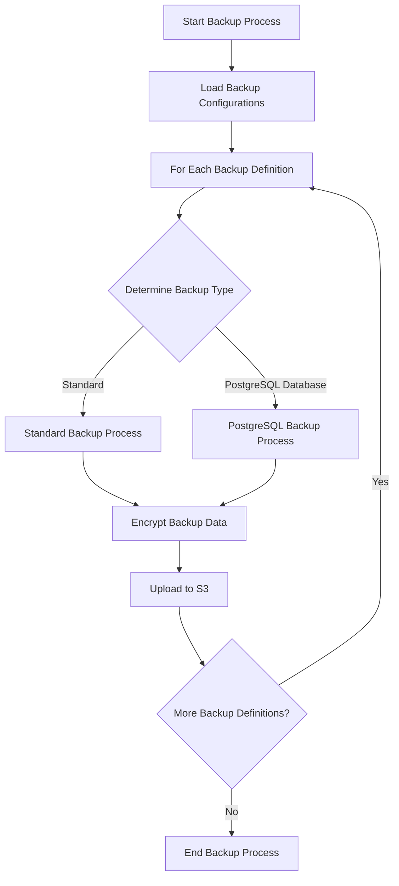
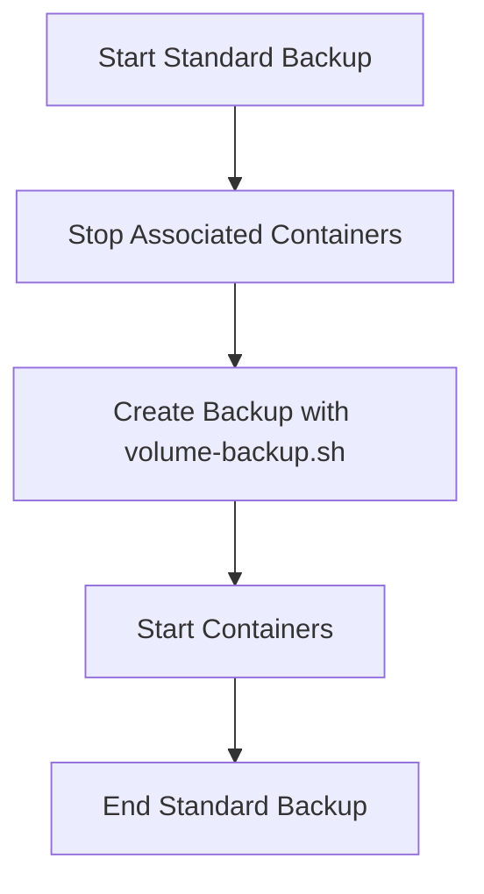
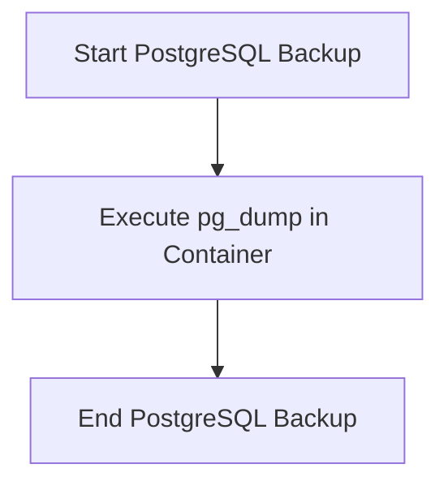

~~~gos3/cmd/Execute.go
package cmd

import (
	"log"

	"github.com/spf13/cobra"
)

func Execute() {
	err := rootCmd.Execute()
	if err != nil {
		log.Fatal(err)
	}
}

func addListFlags(cmd *cobra.Command) {
	cmd.Flags().String("prefix", "", "Prefix of bucket")
	cmd.Flags().String("delimiter", "", "List delimiter. '' for recursive '/' for local items only")
}

func addKeyFlags(cmd *cobra.Command) {
	cmd.Flags().String("salt", "", "Salt for key generation")
	cmd.Flags().Int("iterations", 0, "Iterations for key generation")
}

func init() {
	rootCmd.AddCommand(listCmd)
	rootCmd.AddCommand(derivekeyCmd)
	rootCmd.AddCommand(volumebackupCmd)
	rootCmd.AddCommand(volumerestoreCmd)
	rootCmd.AddCommand(fileEncryptCmd)
	rootCmd.AddCommand(fileDecryptCmd)
	rootCmd.AddCommand(keyGenerateCmd)
	rootCmd.AddCommand(keyEncryptCmd)
	rootCmd.AddCommand(keyDecryptCmd)
	rootCmd.AddCommand(keyDecrypt2Cmd)
	rootCmd.AddCommand(splitCmd)
	rootCmd.AddCommand(joinCmd)
	rootCmd.AddCommand(s3UploadCmd)
	rootCmd.AddCommand(manualBackupCmd)
	rootCmd.AddCommand(downloadCmd)

	volumebackupCmd.Flags().BoolP("no-compression", "n", false, "Create backup without compression")

	s3UploadCmd.Flags().String("local", "", "Override the local folder path from config")
	s3UploadCmd.Flags().String("s3folder", "", "Override the S3 folder path from config")

	addListFlags(listCmd)
	addKeyFlags(derivekeyCmd)
}

~~~

~~~gos3/cmd/asymmetric.go
package cmd

import (
	"fmt"
	"syscall"

	"gos3/internal/config"
	"gos3/internal/script"

	"github.com/spf13/cobra"
	"golang.org/x/term"
)

var keyGenerateCmd = &cobra.Command{
	Use:   "keygenerate",
	Short: "Generate a public-private key pair",
	Args:  cobra.NoArgs,
	RunE: func(cmd *cobra.Command, args []string) error {
		configuration, err := config.LoadConfiguration("")
		if err != nil {
			return fmt.Errorf("failed to load configuration: %w", err)
		}

		return script.KeyGenerate(configuration)
	},
}

var keyEncryptCmd = &cobra.Command{
	Use:   "keyencrypt <input_file> <output_encrypted_file> <public_key_file>",
	Short: "Encrypt a file using a public key",
	Args:  cobra.ExactArgs(3),
	RunE: func(cmd *cobra.Command, args []string) error {
		configuration, err := config.LoadConfiguration("")
		if err != nil {
			return fmt.Errorf("failed to load configuration: %w", err)
		}

		return script.KeyEncrypt(args[0], args[1], args[2], configuration)
	},
}

var keyDecryptCmd = &cobra.Command{
	Use:   "keydecrypt <input_encrypted_file> <output_decrypted_file> <private_key_file>",
	Short: "Decrypt a file using a private key",
	Args:  cobra.ExactArgs(3),
	RunE: func(cmd *cobra.Command, args []string) error {
		configuration, err := config.LoadConfiguration("")
		if err != nil {
			return fmt.Errorf("failed to load configuration: %w", err)
		}

		return script.KeyDecrypt(args[0], args[1], args[2], configuration)
	},
}

var keyDecrypt2Cmd = &cobra.Command{
	Use:   "keydecrypt2 <input_encrypted_file> <output_decrypted_file> <encrypted_private_key_file>",
	Short: "Decrypt a file using an encrypted private key",
	Args:  cobra.ExactArgs(3),
	RunE: func(cmd *cobra.Command, args []string) error {
		configuration, err := config.LoadConfiguration("")
		if err != nil {
			return fmt.Errorf("failed to load configuration: %w", err)
		}

		fmt.Print("Enter private key decryption password: ")
		password, err := term.ReadPassword(int(syscall.Stdin))
		if err != nil {
			return fmt.Errorf("failed to read password: %w", err)
		}
		fmt.Println()

		return script.KeyDecrypt2(args[0], args[1], args[2], string(password), configuration)
	},
}

~~~

~~~gos3/cmd/derivekey.go
package cmd

import (
	"gos3/internal/config"
	"gos3/internal/script"

	"github.com/spf13/cobra"
)

var derivekeyCmd = &cobra.Command{
	Use:   "derivekey",
	Short: "derivekey",
	Args:  cobra.ExactArgs(1),
	RunE: func(cmd *cobra.Command, args []string) error {
		configuration, err := config.LoadConfiguration("")
		if err != nil {
			return err
		}
		password := args[0]
		salt, _ := cmd.Flags().GetString("salt")
		iterations, _ := cmd.Flags().GetInt("iterations")
		result, err := script.DeriveKey(password, salt, iterations, configuration)
		if err != nil {
			return err
		}
		script.PrintDeriveKeyResult(result)
		return nil
	},
}

~~~

~~~gos3/cmd/download.go
package cmd

import (
	"fmt"
	"gos3/internal/config"
	"gos3/internal/s3"

	"github.com/spf13/cobra"
)

var downloadCmd = &cobra.Command{
	Use:   "download",
	Short: "Download and decrypt backups",
	Long:  `Download backups from S3, join split files if necessary, and decrypt the files`,
	RunE:  runDownload,
}

func runDownload(cmd *cobra.Command, args []string) error {
	cfg, err := config.LoadConfiguration("")
	if err != nil {
		return fmt.Errorf("failed to load configuration: %w", err)
	}

	return s3.DownloadBackup(cfg)
}

~~~

~~~gos3/cmd/filedecrypt.go
package cmd

import (
	"fmt"
	"gos3/internal/config"
	"gos3/internal/script"
	"syscall"

	"github.com/spf13/cobra"
	"golang.org/x/term"
)

var fileDecryptCmd = &cobra.Command{
	Use:   "filedecrypt <input_encrypted_file> <output_decrypted_file>",
	Short: "Decrypt a file",
	Args:  cobra.ExactArgs(2),
	RunE: func(cmd *cobra.Command, args []string) error {
		configuration, err := config.LoadConfiguration("")
		if err != nil {
			return fmt.Errorf("failed to load configuration: %w", err)
		}

		fmt.Print("Enter decryption password: ")
		password, err := term.ReadPassword(int(syscall.Stdin))
		if err != nil {
			return fmt.Errorf("failed to read password: %w", err)
		}
		fmt.Println()

		err = script.FileDecrypt(args[0], args[1], string(password), configuration)
		if err != nil {
			return err
		}

		fmt.Println("File decrypted successfully.")
		return nil
	},
}

~~~

~~~gos3/cmd/fileencrypt.go
package cmd

import (
	"fmt"
	"gos3/internal/config"
	"gos3/internal/script"
	"syscall"

	"github.com/spf13/cobra"
	"golang.org/x/term"
)

var fileEncryptCmd = &cobra.Command{
	Use:   "fileencrypt <input_file> <output_encrypted_file>",
	Short: "Encrypt a file",
	Args:  cobra.ExactArgs(2),
	RunE: func(cmd *cobra.Command, args []string) error {
		configuration, err := config.LoadConfiguration("")
		if err != nil {
			return fmt.Errorf("failed to load configuration: %w", err)
		}

		fmt.Print("Enter encryption password: ")
		password, err := term.ReadPassword(int(syscall.Stdin))
		if err != nil {
			return fmt.Errorf("failed to read password: %w", err)
		}
		fmt.Println()

		err = script.FileEncrypt(args[0], args[1], string(password), configuration)
		if err != nil {
			return err
		}

		fmt.Println("File encrypted successfully.")
		return nil
	},
}

~~~

~~~gos3/cmd/list.go
package cmd

import (
	"gos3/internal/config"
	"gos3/internal/s3"

	"github.com/spf13/cobra"
)

var listCmd = &cobra.Command{
	Use:   "list",
	Short: "list",
	RunE: func(cmd *cobra.Command, args []string) error {
		s3config, err := config.LoadConfiguration("")
		if err != nil {
			return err
		}
		prefix, _ := cmd.Flags().GetString("prefix")
		delimiter, _ := cmd.Flags().GetString("delimiter")
		items, err := s3.ListS3Bucket(s3config, prefix, delimiter)
		if err != nil {
			return err
		}
		s3.PrintS3ItemList(items)
		return nil
	},
}

~~~

~~~gos3/cmd/manualbackup.go
package cmd

import (
	"fmt"
	"gos3/internal/config"
	"gos3/internal/backupops"
	"log"

	"github.com/spf13/cobra"
)

var manualBackupCmd = &cobra.Command{
	Use:   "manualbackup",
	Short: "Perform a manual backup of all defined backups",
	Long:  `Perform a manual backup of all backup definitions from the configuration.`,
	RunE:  runManualBackup,
}


func runManualBackup(cmd *cobra.Command, args []string) error {
	cfg, err := config.LoadConfiguration("")
	if err != nil {
		return fmt.Errorf("failed to load configuration: %w", err)
	}

	log.Println("Starting manual backup process for all defined backups")
	err = backupops.PerformBackups(cfg)
	if err != nil {
		return fmt.Errorf("failed to perform backups: %w", err)
	}
	log.Println("Manual backup process completed successfully")

	return nil
}
~~~

~~~gos3/cmd/root.go
package cmd

import (
	"github.com/spf13/cobra"
)

var rootCmd = &cobra.Command{
	Use:   "gos3",
	Short: "gos3",
}

~~~

~~~gos3/cmd/s3upload.go
package cmd

import (
	"fmt"

	"gos3/internal/config"
	"gos3/internal/s3"

	"github.com/spf13/cobra"
)

var s3UploadCmd = &cobra.Command{
	Use:   "s3upload",
	Short: "Upload the configured local folder to S3",
	RunE: func(cmd *cobra.Command, args []string) error {
		configuration, err := config.LoadConfiguration("")
		if err != nil {
			return fmt.Errorf("failed to load configuration: %w", err)
		}

		localFolderOverride, _ := cmd.Flags().GetString("local")
		s3FolderOverride, _ := cmd.Flags().GetString("s3folder")

		localFolder := configuration.App.LocalBackupFolder
		if localFolderOverride != "" {
			localFolder = localFolderOverride
		}

		s3Folder := configuration.S3.BackupFolder
		if s3FolderOverride != "" {
			s3Folder = s3FolderOverride
		}

		fmt.Printf("Uploading from %s to S3 folder %s\n", localFolder, s3Folder)

		err = s3.UploadFolderToS3(localFolder, s3Folder, configuration)
		if err != nil {
			return fmt.Errorf("failed to upload folder to S3: %w", err)
		}

		fmt.Println("Folder uploaded successfully to S3")
		return nil
	},
}

~~~

~~~gos3/cmd/splitjoin.go
package cmd

import (
	"gos3/internal/config"
	"gos3/internal/script"

	"github.com/spf13/cobra"
)

var splitCmd = &cobra.Command{
	Use:   "split <folder_path> <split_size>",
	Short: "Split files in a folder",
	Args:  cobra.ExactArgs(2),
	RunE: func(cmd *cobra.Command, args []string) error {
		configuration, err := config.LoadConfiguration("")
		if err != nil {
			return err
		}
		return script.Split(args[0], args[1], configuration)
	},
}

var joinCmd = &cobra.Command{
	Use:   "join <folder_path>",
	Short: "Join split files in a folder",
	Args:  cobra.ExactArgs(1),
	RunE: func(cmd *cobra.Command, args []string) error {
		configuration, err := config.LoadConfiguration("")
		if err != nil {
			return err
		}
		return script.Join(args[0], configuration)
	},
}

~~~

~~~gos3/cmd/volumebackup.go
package cmd

import (
	"fmt"
	"gos3/internal/config"
	"gos3/internal/script"

	"github.com/spf13/cobra"
)

var volumebackupCmd = &cobra.Command{
	Use:   "volumebackup <volume_name> <backup_file_name>",
	Short: "Backup a Docker volume",
	Args:  cobra.ExactArgs(2),
	RunE: func(cmd *cobra.Command, args []string) error {
		volumeName := args[0]
		backupFileName := args[1]

		configuration, err := config.LoadConfiguration("")
		if err != nil {
			return fmt.Errorf("failed to load configuration: %w", err)
		}

		noCompression, _ := cmd.Flags().GetBool("no-compression")
		compress := !noCompression

		result, err := script.VolumeBackup(volumeName, backupFileName, compress, configuration)
		if err != nil {
			return fmt.Errorf("volume backup failed: %w", err)
		}

		fmt.Printf("Backup of volume %s created as %s\n", volumeName, backupFileName)
		fmt.Printf("Original size: %d bytes\n", result.OriginalSize)
		fmt.Printf("Final size: %d bytes\n", result.FinalSize)
		fmt.Printf("Compression ratio: %.2f\n", result.CompressionRatio)
		fmt.Printf("Time elapsed: %.6f seconds\n", result.TimeElapsed)

		return nil
	},
}

~~~

~~~gos3/cmd/volumerestore.go
package cmd

import (
	"fmt"
	"gos3/internal/config"
	"gos3/internal/script"

	"github.com/spf13/cobra"
)

var volumerestoreCmd = &cobra.Command{
	Use:   "volumerestore <volume_name> <backup_file_name>",
	Short: "Restore a Docker volume from a backup",
	Args:  cobra.ExactArgs(2),
	RunE: func(cmd *cobra.Command, args []string) error {
		volumeName := args[0]
		backupFileName := args[1]

		configuration, err := config.LoadConfiguration("")
		if err != nil {
			return fmt.Errorf("failed to load configuration: %w", err)
		}

		err = script.VolumeRestore(volumeName, backupFileName, configuration)
		if err != nil {
			return fmt.Errorf("volume restore failed: %w", err)
		}

		fmt.Printf("Volume %s restored successfully from %s\n", volumeName, backupFileName)
		return nil
	},
}

~~~

~~~gos3/doc/automated-backup-process.md
# Automated Backup Process Documentation

## Backup Configuration Structure

The backup configuration will be defined in a YAML file with the following structure:

```yaml
backupDefinitions:
  - name: "backup1"
    type: "standard"
    containers:
      - "container1"
      - "container2"
    volumes:
      - "volume1"
      - "volume2"
  - name: "backup2"
    type: "postgresqldatabase"
    containers:
      - "postgres_container"
    volumes: []
```

## Backup Process Workflow

The general workflow for the automated backup process will be as follows:



### Standard Backup Process

For standard backups, the process will be:



### PostgreSQL Database Backup Process

For PostgreSQL database backups, the process will be:



## Implementation Considerations

1. **Configuration Parsing**: Implement YAML parsing to read the backup configurations.
2. **Backup Type Handling**: Create separate functions or modules for each backup type (standard, PostgreSQL, etc.).
3. **Error Handling**: Implement robust error handling and logging throughout the process.
4. **Scheduling**: Consider implementing a scheduling mechanism to run backups at specified intervals.
5. **Monitoring**: Add monitoring and alerting for backup failures or issues.
6. **Encryption**: Ensure all backups are encrypted before being uploaded to S3.
7. **S3 Integration**: Implement secure and efficient uploading to S3, including handling large files.

## Next Steps

1. Implement the configuration file structure and parsing.
2. Develop the main backup orchestration logic.
3. Implement the standard backup process using existing scripts.
4. Develop the PostgreSQL backup process.
5. Integrate encryption and S3 uploading.
6. Add scheduling capabilities.
7. Implement logging and monitoring.
8. Test thoroughly with various backup scenarios.
~~~

~~~gos3/env.sh
export S3CONFIGFILE="../../../keys/do-s3.yaml"

~~~

~~~gos3/go.mod
module gos3

go 1.23.0

require (
	github.com/aws/aws-sdk-go v1.55.5 // indirect
	github.com/inconshreveable/mousetrap v1.1.0 // indirect
	github.com/jmespath/go-jmespath v0.4.0 // indirect
	github.com/spf13/cobra v1.8.1 // indirect
	github.com/spf13/pflag v1.0.5 // indirect
	golang.org/x/sys v0.24.0 // indirect
	golang.org/x/term v0.23.0 // indirect
	gopkg.in/yaml.v3 v3.0.1 // indirect
)

~~~

~~~gos3/go.sum
github.com/aws/aws-sdk-go v1.55.5 h1:KKUZBfBoyqy5d3swXyiC7Q76ic40rYcbqH7qjh59kzU=
github.com/aws/aws-sdk-go v1.55.5/go.mod h1:eRwEWoyTWFMVYVQzKMNHWP5/RV4xIUGMQfXQHfHkpNU=
github.com/cpuguy83/go-md2man/v2 v2.0.4/go.mod h1:tgQtvFlXSQOSOSIRvRPT7W67SCa46tRHOmNcaadrF8o=
github.com/davecgh/go-spew v1.1.0/go.mod h1:J7Y8YcW2NihsgmVo/mv3lAwl/skON4iLHjSsI+c5H38=
github.com/inconshreveable/mousetrap v1.1.0 h1:wN+x4NVGpMsO7ErUn/mUI3vEoE6Jt13X2s0bqwp9tc8=
github.com/inconshreveable/mousetrap v1.1.0/go.mod h1:vpF70FUmC8bwa3OWnCshd2FqLfsEA9PFc4w1p2J65bw=
github.com/jmespath/go-jmespath v0.4.0 h1:BEgLn5cpjn8UN1mAw4NjwDrS35OdebyEtFe+9YPoQUg=
github.com/jmespath/go-jmespath v0.4.0/go.mod h1:T8mJZnbsbmF+m6zOOFylbeCJqk5+pHWvzYPziyZiYoo=
github.com/jmespath/go-jmespath/internal/testify v1.5.1/go.mod h1:L3OGu8Wl2/fWfCI6z80xFu9LTZmf1ZRjMHUOPmWr69U=
github.com/pmezard/go-difflib v1.0.0/go.mod h1:iKH77koFhYxTK1pcRnkKkqfTogsbg7gZNVY4sRDYZ/4=
github.com/russross/blackfriday/v2 v2.1.0/go.mod h1:+Rmxgy9KzJVeS9/2gXHxylqXiyQDYRxCVz55jmeOWTM=
github.com/spf13/cobra v1.8.1 h1:e5/vxKd/rZsfSJMUX1agtjeTDf+qv1/JdBF8gg5k9ZM=
github.com/spf13/cobra v1.8.1/go.mod h1:wHxEcudfqmLYa8iTfL+OuZPbBZkmvliBWKIezN3kD9Y=
github.com/spf13/pflag v1.0.5 h1:iy+VFUOCP1a+8yFto/drg2CJ5u0yRoB7fZw3DKv/JXA=
github.com/spf13/pflag v1.0.5/go.mod h1:McXfInJRrz4CZXVZOBLb0bTZqETkiAhM9Iw0y3An2Bg=
github.com/stretchr/objx v0.1.0/go.mod h1:HFkY916IF+rwdDfMAkV7OtwuqBVzrE8GR6GFx+wExME=
golang.org/x/sys v0.24.0 h1:Twjiwq9dn6R1fQcyiK+wQyHWfaz/BJB+YIpzU/Cv3Xg=
golang.org/x/sys v0.24.0/go.mod h1:/VUhepiaJMQUp4+oa/7Zr1D23ma6VTLIYjOOTFZPUcA=
golang.org/x/term v0.23.0 h1:F6D4vR+EHoL9/sWAWgAR1H2DcHr4PareCbAaCo1RpuU=
golang.org/x/term v0.23.0/go.mod h1:DgV24QBUrK6jhZXl+20l6UWznPlwAHm1Q1mGHtydmSk=
gopkg.in/check.v1 v0.0.0-20161208181325-20d25e280405/go.mod h1:Co6ibVJAznAaIkqp8huTwlJQCZ016jof/cbN4VW5Yz0=
gopkg.in/yaml.v2 v2.2.8/go.mod h1:hI93XBmqTisBFMUTm0b8Fm+jr3Dg1NNxqwp+5A1VGuI=
gopkg.in/yaml.v3 v3.0.1 h1:fxVm/GzAzEWqLHuvctI91KS9hhNmmWOoWu0XTYJS7CA=
gopkg.in/yaml.v3 v3.0.1/go.mod h1:K4uyk7z7BCEPqu6E+C64Yfv1cQ7kz7rIZviUmN+EgEM=

~~~

~~~gos3/internal/backupops/PerformBackups.go
package backupops

import (
	"gos3/internal/config"
	"log"
)

func PerformBackups(cfg config.Config) error {
	for _, backupDef := range cfg.BackupDefinitions {
		log.Printf("Starting backup process for: %s", backupDef.Name)

		var err error
		switch backupDef.Type {
		case "standard":
			err = PerformStandardBackup(backupDef, cfg)
		default:
			log.Printf("Unknown backup type: %s for backup: %s", backupDef.Type, backupDef.Name)
			continue
		}

		if err != nil {
			log.Printf("Error performing backup %s: %v", backupDef.Name, err)
			return err
		}

		log.Printf("Completed backup process for: %s", backupDef.Name)
	}

	return nil
}

~~~

~~~gos3/internal/backupops/PerformStandardBackup.go
package backupops

import (
	"fmt"
	"gos3/internal/config"
	"gos3/internal/s3"
	"gos3/internal/script"
	"log"
	"os"
	"path/filepath"
)

func PerformStandardBackup(def config.BackupDefinition, cfg config.Config) error {
	log.Printf("Starting backup process for: %s", def.Name)
	log.Printf("Stopping containers: %v", def.Containers)

	err := stopContainers(def.Containers)
	if err != nil {
		return err
	}
	volumeCreationErrors := ""
	log.Printf("Containers stopped successfully: %v", def.Containers)

	for i, volumeName := range def.Volumes {
		backupFileName := generateBackupFileName(def.Name, volumeName, i)
		backupFilePath := filepath.Join(cfg.App.LocalBackupFolder, backupFileName)
		log.Printf("Creating backup for volume: %s", volumeName)

		_, err = script.VolumeBackup(volumeName, backupFilePath, true, cfg)
		if err != nil {
			volumeCreationErrors = err.Error()
			log.Printf("Backup failed for volume: %s, %s", volumeName, err.Error())
			break
		}
		log.Printf("Backup created successfully for volume: %s", volumeName)

		err = changeBackupPermissions(backupFilePath, cfg)
		if err != nil {
			log.Printf("Warning: failed to change permissions for %s: %v", backupFilePath, err)
		}
	}

	log.Printf("Starting containers: %v", def.Containers)
	err = startContainers(def.Containers)
	if err != nil {
		return err
	}
	log.Printf("Containers started successfully: %v", def.Containers)

	if len(volumeCreationErrors) != 0 {
		return fmt.Errorf("error creating volumes: %s", volumeCreationErrors)
	}

	for i, volumeName := range def.Volumes {
		backupFileName := generateBackupFileName(def.Name, volumeName, i)
		backupFilePath := filepath.Join(cfg.App.LocalBackupFolder, backupFileName)

		encryptedFilePath := backupFilePath + ".cpt"
		passFilePath := encryptedFilePath + ".pass"

		err = encryptBackup(backupFilePath, encryptedFilePath, cfg)
		if err != nil {
			return fmt.Errorf("failed to encrypt backup for volume %s: %w", volumeName, err)
		}

		s3Subfolder := s3.GenerateSubfolderName(cfg.App.BackupFrequency)

		// Upload .cpt file
		s3PathCpt := filepath.Join(cfg.S3.BackupFolder, s3Subfolder, backupFileName+".cpt")
		err = s3.UploadToS3(encryptedFilePath, s3PathCpt, cfg.S3)
		if err != nil {
			return fmt.Errorf("failed to upload encrypted backup for volume %s to S3: %w", volumeName, err)
		}

		// Upload .pass file
		s3PathPass := filepath.Join(cfg.S3.BackupFolder, s3Subfolder, backupFileName+".cpt.pass")
		err = s3.UploadToS3(passFilePath, s3PathPass, cfg.S3)
		if err != nil {
			return fmt.Errorf("failed to upload pass file for volume %s to S3: %w", volumeName, err)
		}

		// Clean up local files
		for _, filePath := range []string{backupFilePath, encryptedFilePath, passFilePath} {
			err = os.Remove(filePath)
			if err != nil {
				log.Printf("Warning: failed to remove local file %s: %v", filePath, err)
			}
		}
	}

	return nil
}

~~~

~~~gos3/internal/backupops/helpers.go
package backupops

import (
	"fmt"
	"gos3/internal/config"
	"gos3/internal/script"
	"log"
	"os"
	"os/exec"
	"path/filepath"
	"sync"
)

func stopContainers(containers []string) error {
	var wg sync.WaitGroup
	errChan := make(chan error, len(containers))

	for _, container := range containers {
		wg.Add(1)
		go func(c string) {
			defer wg.Done()
			cmd := exec.Command("docker", "stop", c)
			if err := cmd.Run(); err != nil {
				errChan <- fmt.Errorf("failed to stop container %s: %w", c, err)
			}
		}(container)
	}

	wg.Wait()
	close(errChan)

	for err := range errChan {
		if err != nil {
			return err
		}
	}

	return nil
}

func startContainers(containers []string) error {
	var wg sync.WaitGroup
	errChan := make(chan error, len(containers))

	for _, container := range containers {
		wg.Add(1)
		go func(c string) {
			defer wg.Done()
			cmd := exec.Command("docker", "start", c)
			if err := cmd.Run(); err != nil {
				errChan <- fmt.Errorf("failed to start container %s: %w", c, err)
			}
		}(container)
	}

	wg.Wait()
	close(errChan)

	var errors []error
	for err := range errChan {
		if err != nil {
			errors = append(errors, err)
		}
	}

	if len(errors) > 0 {
		return fmt.Errorf("failed to start one or more containers: %v", errors)
	}

	return nil
}

func generateBackupFileName(backupName string, volumeName string, index int) string {
	if isVolumePath(volumeName) {
		return fmt.Sprintf("%s-%d.tar.gz", backupName, index)
	}
	return fmt.Sprintf("%s-%s.tar.gz", backupName, volumeName)
}

func encryptBackup(inputFile, outputFile string, cfg config.Config) error {
	err := script.KeyEncrypt(inputFile, outputFile, cfg.App.PublicKeyFile, cfg)
	if err != nil {
		return fmt.Errorf("failed to encrypt backup: %w", err)
	}

	log.Printf("Encrypted file: %s to %s", inputFile, outputFile)
	return nil
}

func isVolumePath(volumeName string) bool {
	// Check if the volume name is a file path
	return filepath.IsAbs(volumeName)
}

func changeBackupPermissions(backupFilePath string, cfg config.Config) error {
    cmd := exec.Command("docker", "run", "--rm", "-v", fmt.Sprintf("%s:/backup", filepath.Dir(backupFilePath)),
        "alpine", "chown", "-R", fmt.Sprintf("%d:%d", os.Getuid(), os.Getgid()), "/backup")
    return cmd.Run()
}

~~~

~~~gos3/internal/config/config.go
package config

import (
	"fmt"
	"os"

	"gopkg.in/yaml.v3"
)

type S3Config struct {
	Endpoint        string `yaml:"endpoint"`
	Bucket          string `yaml:"bucket"`
	AccessKeyID     string `yaml:"accessKeyId"`
	AccessKeySecret string `yaml:"accessKeySecret"`
	Region          string `yaml:"region"`
	MaxFileSize     string `yaml:"maxFileSize"`
	BackupFolder    string `yaml:"backupFolder"`
}

type AppConfig struct {
	ScriptsFolder     string `yaml:"scriptsFolder"`
	LocalBackupFolder string `yaml:"localBackupFolder"`
	BackupFrequency   string `yaml:"backupFrequency"`
	PublicKeyFile     string `yaml:"publicKeyFile"`
	PrivateKeyFile    string `yaml:"privateKeyFile"`
    PrivateKeyMetadata string `yaml:"privateKeyMetadata"`
}

type BackupDefinition struct {
	Name       string   `yaml:"name"`
	Type       string   `yaml:"type"`
	Containers []string `yaml:"containers"`
	Volumes    []string `yaml:"volumes"`
}

type VolumeConfig struct {
	Name       string `yaml:"name"`
	BackupName string `yaml:"backupName"`
	Compress   bool   `yaml:"compress"`
}

type Config struct {
	S3                S3Config           `yaml:"s3"`
	App               AppConfig          `yaml:"app"`
	Volumes           []VolumeConfig     `yaml:"volumes"`
	BackupDefinitions []BackupDefinition `yaml:"backupDefinitions"`
}

func LoadConfiguration(configFileName string) (Config, error) {
	var config Config

	if configFileName == "" {
		configFileName = os.Getenv("S3CONFIGFILE")
		if configFileName == "" {
			return config, fmt.Errorf("no configuration file provided and S3CONFIGFILE environment variable is not set")
		}
	}

	file, err := os.Open(configFileName)
	if err != nil {
		return config, fmt.Errorf("failed to open configuration file: %w", err)
	}
	defer file.Close()

	decoder := yaml.NewDecoder(file)
	if err := decoder.Decode(&config); err != nil {
		return config, fmt.Errorf("failed to decode configuration file: %w", err)
	}

	return config, nil
}

~~~

~~~gos3/internal/s3/ListS3Bucket.go
package s3

import (
	"fmt"
	"strings"

	"gos3/internal/config"

	"github.com/aws/aws-sdk-go/aws"
	"github.com/aws/aws-sdk-go/aws/credentials"
	"github.com/aws/aws-sdk-go/aws/session"
	"github.com/aws/aws-sdk-go/service/s3"
)

type S3Item struct {
	Name            string `json:"name" yaml:"name"`
	IsFolder        bool   `json:"isFolder" yaml:"isFolder"`
	LastModified    int64  `json:"lastModified" yaml:"lastModified"`
	LastModifiedStr string `json:"lastModifiedStr" yaml:"lastModifiedStr"`
	Size            int64  `json:"size" yaml:"size"`
}

func ListS3Bucket(s3config config.Config, prefix string, delimiter string) ([]S3Item, error) {
	sess, err := session.NewSession(&aws.Config{
		Region:      aws.String(s3config.S3.Region),
		Endpoint:    aws.String(s3config.S3.Endpoint),
		Credentials: credentials.NewStaticCredentials(s3config.S3.AccessKeyID, s3config.S3.AccessKeySecret, ""),
	})

	if err != nil {
		return nil, fmt.Errorf("failed to create session: %w", err)
	}

	svc := s3.New(sess)

	input := &s3.ListObjectsV2Input{
		Bucket:    aws.String(s3config.S3.Bucket),
		Prefix:    aws.String(prefix),
		Delimiter: aws.String(delimiter),
	}

	result, err := svc.ListObjectsV2(input)
	if err != nil {
		return nil, fmt.Errorf("unable to list items in bucket %q, %v", s3config.S3.Bucket, err)
	}

	var items []S3Item

	for _, prefix := range result.CommonPrefixes {
		items = append(items, S3Item{
			Name:     *prefix.Prefix,
			IsFolder: true,
		})
	}

	for _, item := range result.Contents {
		lastModifiedUnix := item.LastModified.UnixMilli()
		lastModifiedStr := item.LastModified.UTC().Format("2006-01-02 15:04:05.000")

		items = append(items, S3Item{
			Name:            *item.Key,
			LastModified:    lastModifiedUnix,
			LastModifiedStr: lastModifiedStr,
			Size:            *item.Size,
		})
	}

	return items, nil
}

func PrintS3ItemList(items []S3Item) {
	maxNameWidth := len("Name")
	maxDateWidth := len("Last-Modified")
	maxSizeWidth := len("Size")
	maxIsfolderWidth := len("Is-Folder")

	for _, item := range items {
		if len(item.Name) > maxNameWidth {
			maxNameWidth = len(item.Name)
		}
		if len(item.LastModifiedStr) > maxDateWidth {
			maxDateWidth = len(item.LastModifiedStr)
		}
		sizeWidth := len(fmt.Sprintf("%d", item.Size))
		if sizeWidth > maxSizeWidth {
			maxSizeWidth = sizeWidth
		}
	}

	fmt.Printf("%-*s  %-*s  %-*s  %-*s\n", maxNameWidth, "Name", maxDateWidth, "Last-Modified", maxSizeWidth, "Size", maxIsfolderWidth, "Is-Folder")
	fmt.Println(strings.Repeat("-", maxNameWidth+maxDateWidth+maxSizeWidth+maxIsfolderWidth+6))

	for _, item := range items {
		isFolder := 0
		if item.IsFolder {
			isFolder = 1
		}
		fmt.Printf("%-*s  %-*s  %-*d  %-*d\n",
			maxNameWidth, item.Name,
			maxDateWidth, item.LastModifiedStr,
			maxSizeWidth, item.Size,
			maxIsfolderWidth, isFolder)
	}
}

~~~

~~~gos3/internal/s3/download.go
package s3

import (
	"fmt"
	"io"
	"log"
	"os"
	"path/filepath"
	"sort"
	"strings"
	"syscall"

	"gos3/internal/config"
	"gos3/internal/script"

	"github.com/aws/aws-sdk-go/aws"
	"github.com/aws/aws-sdk-go/aws/credentials"
	"github.com/aws/aws-sdk-go/aws/session"
	"github.com/aws/aws-sdk-go/service/s3"
	"github.com/aws/aws-sdk-go/service/s3/s3manager"
	"golang.org/x/term"
)

func ListBackupVersions(cfg config.Config) ([]string, error) {
	sess, err := createS3Session(cfg.S3)
	if err != nil {
		return nil, err
	}

	svc := s3.New(sess)

	resp, err := svc.ListObjectsV2(&s3.ListObjectsV2Input{
		Bucket: aws.String(cfg.S3.Bucket),
		Prefix: aws.String(cfg.S3.BackupFolder),
	})
	if err != nil {
		return nil, fmt.Errorf("failed to list objects: %w", err)
	}

	versions := make(map[string]struct{})
	for _, item := range resp.Contents {
		parts := strings.Split(*item.Key, "/")
		if len(parts) > 1 {
			versions[parts[1]] = struct{}{}
		}
	}

	result := make([]string, 0, len(versions))
	for v := range versions {
		result = append(result, v)
	}
	sort.Sort(sort.Reverse(sort.StringSlice(result)))

	return result, nil
}

func DownloadBackup(cfg config.Config) error {
	versions, err := ListBackupVersions(cfg)
	if err != nil {
		return err
	}

	fmt.Println("Available backup versions:")
	for i, v := range versions {
		fmt.Printf("%d. %s\n", i+1, v)
	}

	var choice int
	fmt.Print("Enter the number of the version you want to download: ")
	_, err = fmt.Scanf("%d", &choice)
	if err != nil || choice < 1 || choice > len(versions) {
		return fmt.Errorf("invalid choice")
	}

	selectedVersion := versions[choice-1]
	log.Printf("Downloading backup version: %s", selectedVersion)

	sess, err := createS3Session(cfg.S3)
	if err != nil {
		return err
	}

	svc := s3.New(sess)
	downloader := s3manager.NewDownloader(sess)

	prefix := filepath.Join(cfg.S3.BackupFolder, selectedVersion)
	err = svc.ListObjectsV2Pages(&s3.ListObjectsV2Input{
		Bucket: aws.String(cfg.S3.Bucket),
		Prefix: aws.String(prefix),
	}, func(page *s3.ListObjectsV2Output, lastPage bool) bool {
		for _, item := range page.Contents {
			localPath := filepath.Join(cfg.App.LocalBackupFolder, strings.TrimPrefix(*item.Key, prefix))
			if err := downloadFile(downloader, cfg.S3.Bucket, *item.Key, localPath); err != nil {
				log.Printf("Error downloading %s: %v", *item.Key, err)
				continue
			}
		}
		return true
	})

	if err != nil {
		return fmt.Errorf("failed to list objects: %w", err)
	}

	log.Println("All files downloaded. Joining split files...")
	err = joinSplitFiles(cfg.App.LocalBackupFolder)
	if err != nil {
		return fmt.Errorf("failed to join split files: %w", err)
	}

	log.Println("Split files joined. Decrypting files...")
	fmt.Print("Enter the private key password: ")
	password, err := term.ReadPassword(int(syscall.Stdin))
	if err != nil {
		return fmt.Errorf("failed to read password: %w", err)
	}
	fmt.Println()

	if err := decryptFiles(cfg, string(password)); err != nil {
		return fmt.Errorf("failed to decrypt files: %w", err)
	}

	log.Println("Download process completed successfully.")
	return nil
}

func downloadFile(downloader *s3manager.Downloader, bucket, key, localPath string) error {
	dir := filepath.Dir(localPath)
	if err := os.MkdirAll(dir, 0755); err != nil {
		return fmt.Errorf("failed to create directory %s: %w", dir, err)
	}

	file, err := os.Create(localPath)
	if err != nil {
		return fmt.Errorf("failed to create file %s: %w", localPath, err)
	}
	defer file.Close()

	_, err = downloader.Download(file, &s3.GetObjectInput{
		Bucket: aws.String(bucket),
		Key:    aws.String(key),
	})
	if err != nil {
		return fmt.Errorf("failed to download file %s: %w", key, err)
	}

	log.Printf("Downloaded file: %s", localPath)
	return nil
}

func joinSplitFiles(dir string) error {
	files, err := os.ReadDir(dir)
	if err != nil {
		return fmt.Errorf("failed to read directory: %w", err)
	}

	splitFiles := make(map[string][]string)
	for _, file := range files {
		if strings.Contains(file.Name(), ".part") {
			baseName := strings.Split(file.Name(), ".part")[0]
			splitFiles[baseName] = append(splitFiles[baseName], file.Name())
		}
	}

	for baseName, parts := range splitFiles {
		sort.Strings(parts)
		outputFile, err := os.Create(filepath.Join(dir, baseName))
		if err != nil {
			return fmt.Errorf("failed to create output file: %w", err)
		}
		defer outputFile.Close()

		for _, part := range parts {
			partPath := filepath.Join(dir, part)
			partFile, err := os.Open(partPath)
			if err != nil {
				return fmt.Errorf("failed to open part file: %w", err)
			}
			_, err = io.Copy(outputFile, partFile)
			partFile.Close()
			if err != nil {
				return fmt.Errorf("failed to copy part file: %w", err)
			}
			os.Remove(partPath)
		}
		log.Printf("Joined file: %s", baseName)
	}

	return nil
}

func decryptFiles(cfg config.Config, password string) error {
	files, err := os.ReadDir(cfg.App.LocalBackupFolder)
	if err != nil {
		return fmt.Errorf("failed to read directory: %w", err)
	}

	for _, file := range files {
		if strings.HasSuffix(file.Name(), ".cpt") {
			inputFile := filepath.Join(cfg.App.LocalBackupFolder, file.Name())
			outputFile := strings.TrimSuffix(inputFile, ".cpt")

			log.Printf("Decrypting file: %s", inputFile)
			err := script.KeyDecrypt2(inputFile, outputFile, cfg.App.PrivateKeyFile, password, cfg)
			if err != nil {
				return fmt.Errorf("failed to decrypt file %s: %w", file.Name(), err)
			}

			os.Remove(inputFile)
			os.Remove(inputFile + ".pass")
			log.Printf("Decrypted file: %s", outputFile)
		}
	}

	return nil
}

func createS3Session(cfg config.S3Config) (*session.Session, error) {
	return session.NewSession(&aws.Config{
		Region:      aws.String(cfg.Region),
		Endpoint:    aws.String(cfg.Endpoint),
		Credentials: credentials.NewStaticCredentials(cfg.AccessKeyID, cfg.AccessKeySecret, ""),
	})
}

~~~

~~~gos3/internal/s3/operations.go
package s3

import (
	"fmt"
	"io"
	"log"
	"math"
	"os"
	"path/filepath"
	"strconv"
	"strings"
	"time"

	"gos3/internal/config"
	"gos3/internal/script"

	"github.com/aws/aws-sdk-go/aws"
	"github.com/aws/aws-sdk-go/aws/credentials"
	"github.com/aws/aws-sdk-go/aws/session"
	"github.com/aws/aws-sdk-go/service/s3"
	"github.com/aws/aws-sdk-go/service/s3/s3manager"
)

func GenerateSubfolderName(frequency string) string {
	now := time.Now()
	switch frequency {
	case "daily":
		return now.Format("2006-01-02")
	case "weekly":
		year, week := now.ISOWeek()
		return fmt.Sprintf("%d-W%02d", year, week)
	case "hourly":
		return fmt.Sprintf("%s-%02d", now.Format("2006-01-02"), now.Hour())
	case "4hourly":
		return fmt.Sprintf("%s-%02d", now.Format("2006-01-02"), (now.Hour()/4)*4)
	default:
		return now.Format("2006-01-02")
	}
}

func EnsureS3FolderExists(folderPath string, cfg config.S3Config) error {
	sess, err := session.NewSession(&aws.Config{
		Region:   aws.String(cfg.Region),
		Endpoint: aws.String(cfg.Endpoint),
	})
	if err != nil {
		return fmt.Errorf("failed to create session: %w", err)
	}

	svc := s3.New(sess)

	_, err = svc.PutObject(&s3.PutObjectInput{
		Bucket: aws.String(cfg.Bucket),
		Key:    aws.String(folderPath + "/"),
		Body:   strings.NewReader(""),
	})
	if err != nil {
		return fmt.Errorf("failed to create folder in S3: %w", err)
	}

	return nil
}

func UploadFolderToS3(localFolder, s3Folder string, cfg config.Config) error {
	dateSubfolder := GenerateSubfolderName(cfg.App.BackupFrequency)
	s3FullPath := filepath.Join(s3Folder, dateSubfolder)

	err := filepath.Walk(localFolder, func(path string, info os.FileInfo, err error) error {
		if err != nil {
			return err
		}

		if info.IsDir() {
			return nil
		}

		relPath, err := filepath.Rel(localFolder, path)
		if err != nil {
			return fmt.Errorf("failed to get relative path: %w", err)
		}

		s3Path := filepath.Join(s3FullPath, relPath)
		s3Path = strings.ReplaceAll(s3Path, "\\", "/") // Ensure forward slashes for S3 paths

		if info.Size() > parseSize(cfg.S3.MaxFileSize) {
			fmt.Printf("File %s exceeds maximum size. Splitting...\n", path)
			splitFiles, err := splitFile(path, cfg)
			if err != nil {
				return fmt.Errorf("failed to split file %s: %w", path, err)
			}

			for _, splitFile := range splitFiles {
				splitRelPath, _ := filepath.Rel(filepath.Dir(path), splitFile)
				splitS3Path := filepath.Join(s3FullPath, splitRelPath)
				splitS3Path = strings.ReplaceAll(splitS3Path, "\\", "/")

				fmt.Printf("Uploading split file %s to s3://%s/%s\n", splitFile, cfg.S3.Bucket, splitS3Path)
				err = UploadToS3(splitFile, splitS3Path, cfg.S3)
				if err != nil {
					return fmt.Errorf("failed to upload split file %s: %w", splitFile, err)
				}
			}
		} else {
			fmt.Printf("Uploading %s to s3://%s/%s\n", path, cfg.S3.Bucket, s3Path)
			err = UploadToS3(path, s3Path, cfg.S3)
			if err != nil {
				return fmt.Errorf("failed to upload file %s: %w", path, err)
			}
		}

		return nil
	})

	if err != nil {
		return fmt.Errorf("error walking through local folder: %w", err)
	}

	return nil
}

func splitFile(filePath string, cfg config.Config) ([]string, error) {
	tempDir, err := os.MkdirTemp("", "split_files")
	if err != nil {
		return nil, fmt.Errorf("failed to create temp directory: %w", err)
	}
	defer os.RemoveAll(tempDir)

	err = script.Split(filePath, cfg.S3.MaxFileSize, cfg)
	if err != nil {
		return nil, fmt.Errorf("failed to split file: %w", err)
	}

	splitFiles, err := filepath.Glob(filepath.Join(tempDir, "*"))
	if err != nil {
		return nil, fmt.Errorf("failed to get split files: %w", err)
	}

	return splitFiles, nil
}

func UploadToS3(localPath, remotePath string, cfg config.S3Config) error {
	log.Printf("Starting upload of %s to S3 path %s", localPath, remotePath)

	sess, err := session.NewSession(&aws.Config{
		Region:      aws.String(cfg.Region),
		Endpoint:    aws.String(cfg.Endpoint),
		Credentials: credentials.NewStaticCredentials(cfg.AccessKeyID, cfg.AccessKeySecret, ""),
	})
	if err != nil {
		return fmt.Errorf("failed to create session: %w", err)
	}

	file, err := os.Open(localPath)
	if err != nil {
		return fmt.Errorf("failed to open file %s: %w", localPath, err)
	}
	defer file.Close()

	fileInfo, err := file.Stat()
	if err != nil {
		return fmt.Errorf("failed to get file info: %w", err)
	}

	maxSize := parseSize(cfg.MaxFileSize)
	if fileInfo.Size() > maxSize {
		return uploadLargeFile(sess, localPath, remotePath, cfg, maxSize)
	}

	uploader := s3manager.NewUploader(sess)
	_, err = uploader.Upload(&s3manager.UploadInput{
		Bucket: aws.String(cfg.Bucket),
		Key:    aws.String(remotePath),
		Body:   file,
	})
	if err != nil {
		return fmt.Errorf("failed to upload file to S3: %w", err)
	}

	log.Printf("Successfully uploaded %s to S3", localPath)
	return nil
}

func uploadLargeFile(sess *session.Session, localPath, remotePath string, cfg config.S3Config, maxSize int64) error {
	file, err := os.Open(localPath)
	if err != nil {
		return fmt.Errorf("failed to open file %s: %w", localPath, err)
	}
	defer file.Close()

	fileInfo, _ := file.Stat()
	totalSize := fileInfo.Size()
	totalParts := int(math.Ceil(float64(totalSize) / float64(maxSize)))

	log.Printf("File %s exceeds max size. Splitting into %d parts", localPath, totalParts)

	// Create a subfolder for split files
	fileName := filepath.Base(localPath)
	subfolderPath := filepath.Join(filepath.Dir(remotePath), strings.TrimSuffix(fileName, filepath.Ext(fileName)))
	
	uploader := s3manager.NewUploader(sess)
	
	splitFiles := []string{}

	for i := 0; i < totalParts; i++ {
		partSize := int64(math.Min(float64(maxSize), float64(totalSize-int64(i)*maxSize)))
		partBuffer := make([]byte, partSize)
		
		_, err := file.Read(partBuffer)
		if err != nil && err != io.EOF {
			return fmt.Errorf("failed to read file part: %w", err)
		}

		partNumber := i + 1
		splitFileName := fmt.Sprintf("%s.part%d", fileName, partNumber)
		splitFilePath := filepath.Join(filepath.Dir(localPath), splitFileName)
		
		err = os.WriteFile(splitFilePath, partBuffer, 0644)
		if err != nil {
			return fmt.Errorf("failed to write split file: %w", err)
		}
		
		splitFiles = append(splitFiles, splitFilePath)

		partRemotePath := filepath.Join(subfolderPath, splitFileName)
		
		log.Printf("Uploading part %d/%d of %s", partNumber, totalParts, fileName)
		
		_, err = uploader.Upload(&s3manager.UploadInput{
			Bucket: aws.String(cfg.Bucket),
			Key:    aws.String(partRemotePath),
			Body:   strings.NewReader(string(partBuffer)),
		})
		if err != nil {
			return fmt.Errorf("failed to upload file part to S3: %w", err)
		}
	}

	log.Printf("Successfully uploaded all %d parts of %s", totalParts, fileName)

	// Clean up split files
	for _, splitFile := range splitFiles {
		err := os.Remove(splitFile)
		if err != nil {
			log.Printf("Warning: failed to remove split file %s: %v", splitFile, err)
		}
	}

	return nil
}

func parseSize(size string) int64 {
	var multiplier int64 = 1
	if strings.HasSuffix(size, "K") {
		multiplier = 1024
	} else if strings.HasSuffix(size, "M") {
		multiplier = 1024 * 1024
	} else if strings.HasSuffix(size, "G") {
		multiplier = 1024 * 1024 * 1024
	}

	numericSize, _ := strconv.ParseInt(strings.TrimRight(size, "KMG"), 10, 64)
	return numericSize * multiplier
}

~~~

~~~gos3/internal/script/Asymmetric.go
package script

import (
	"fmt"
	"log"
	"os/exec"
	"path/filepath"

	"gos3/internal/config"
)

func KeyGenerate(configuration config.Config) error {
	scriptPath := filepath.Join(configuration.App.ScriptsFolder, "key-generate.sh")
	cmd := exec.Command(scriptPath)

	output, err := cmd.CombinedOutput()
	if err != nil {
		return fmt.Errorf("error executing key-generate.sh: %w\nOutput: %s", err, string(output))
	}

	fmt.Println(string(output))
	return nil
}

func KeyEncrypt(inputFile, outputFile, publicKeyFile string, configuration config.Config) error {
	scriptPath := filepath.Join(configuration.App.ScriptsFolder, "key-encrypt.sh")
	cmd := exec.Command(scriptPath, inputFile, outputFile, publicKeyFile)

	output, err := cmd.CombinedOutput()
	if err != nil {
		return fmt.Errorf("error executing key-encrypt.sh: %w\nOutput: %s", err, string(output))
	}

	fmt.Println(string(output))
	return nil
}

func KeyDecrypt(inputFile, outputFile, privateKeyFile string, configuration config.Config) error {
	scriptPath := filepath.Join(configuration.App.ScriptsFolder, "key-decrypt.sh")
	cmd := exec.Command(scriptPath, inputFile, outputFile, privateKeyFile)

	output, err := cmd.CombinedOutput()
	if err != nil {
		return fmt.Errorf("error executing key-decrypt.sh: %w\nOutput: %s", err, string(output))
	}

	fmt.Println(string(output))
	return nil
}

func KeyDecrypt2(inputFile, outputFile, encryptedPrivateKeyFile string, privateKeyPassword string, configuration config.Config) error {
	scriptPath := filepath.Join(configuration.App.ScriptsFolder, "key-decrypt2.sh")
	cmd := exec.Command(scriptPath, inputFile, outputFile, encryptedPrivateKeyFile)

	stdin, err := cmd.StdinPipe()
	if err != nil {
		return fmt.Errorf("error creating stdin pipe: %w", err)
	}

	go func() {
		defer stdin.Close()
		stdin.Write([]byte(privateKeyPassword + "\n"))
	}()

	output, err := cmd.CombinedOutput()
	if err != nil {
		return fmt.Errorf("error executing key-decrypt2.sh: %w\nOutput: %s", err, string(output))
	}

	log.Printf("KeyDecrypt2 output: %s", string(output))
	return nil
}

~~~

~~~gos3/internal/script/DeriveKey.go
package script

import (
	"bufio"
	"crypto/rand"
	"encoding/hex"
	"fmt"
	"os/exec"
	"path/filepath"
	"strings"

	"gos3/internal/config"
)

type DeriveKeyResult struct {
	Salt       string
	Iterations string
	Key        string
	TimeTaken  string
}

func generateRandomSalt() (string, error) {
	bytes := make([]byte, 8) // 8 bytes for a 16-character hex string
	_, err := rand.Read(bytes)
	if err != nil {
		return "", err
	}
	return hex.EncodeToString(bytes), nil
}

func DeriveKey(password string, salt string, iterations int, configuration config.Config) (*DeriveKeyResult, error) {
	scriptPath := filepath.Join(configuration.App.ScriptsFolder, "derive-key.sh")

	args := []string{password}

	// If iterations are provided but salt is not, generate a random salt
	if iterations > 0 && salt == "" {
		var err error
		salt, err = generateRandomSalt()
		if err != nil {
			return nil, fmt.Errorf("failed to generate random salt: %w", err)
		}
	}

	// Add salt and iterations to args if they are provided
	if salt != "" {
		args = append(args, salt)
		if iterations > 0 {
			args = append(args, fmt.Sprintf("%d", iterations))
		}
	}

	cmd := exec.Command(scriptPath, args...)

	stdout, err := cmd.StdoutPipe()
	if err != nil {
		return nil, fmt.Errorf("error creating stdout pipe: %w", err)
	}

	stderr, err := cmd.StderrPipe()
	if err != nil {
		return nil, fmt.Errorf("error creating stderr pipe: %w", err)
	}

	if err := cmd.Start(); err != nil {
		return nil, fmt.Errorf("error starting command: %w", err)
	}

	result := &DeriveKeyResult{}
	scanner := bufio.NewScanner(stdout)
	for scanner.Scan() {
		line := scanner.Text()
		parts := strings.SplitN(line, ": ", 2)
		if len(parts) == 2 {
			switch parts[0] {
			case "Salt":
				result.Salt = parts[1]
			case "Iterations":
				result.Iterations = parts[1]
			case "Key":
				result.Key = parts[1]
			case "Time taken":
				result.TimeTaken = parts[1]
			}
		}
	}

	errOutput, _ := bufio.NewReader(stderr).ReadString('\n')
	if errOutput != "" {
		return nil, fmt.Errorf("script error: %s", strings.TrimSpace(errOutput))
	}

	if err := cmd.Wait(); err != nil {
		return nil, fmt.Errorf("command finished with error: %w", err)
	}

	if result.Key == "" {
		return nil, fmt.Errorf("failed to derive key")
	}

	return result, nil
}

func PrintDeriveKeyResult(result *DeriveKeyResult) {
	fmt.Println("Derive Key Result:")
	fmt.Printf("  Salt: %s\n", result.Salt)
	fmt.Printf("  Iterations: %s\n", result.Iterations)
	fmt.Printf("  Key: %s\n", result.Key)
	fmt.Printf("  Time taken: %s\n", result.TimeTaken)
}

~~~

~~~gos3/internal/script/FileDecrypt.go
package script

import (
	"fmt"
	"gos3/internal/config"
	"io"
	"os/exec"
	"path/filepath"
)

func FileDecrypt(inputFile, outputFile string, password string, configuration config.Config) error {
	scriptPath := filepath.Join(configuration.App.ScriptsFolder, "file-decrypt.sh")
	cmd := exec.Command(scriptPath, inputFile, outputFile)

	stdin, err := cmd.StdinPipe()
	if err != nil {
		return fmt.Errorf("error creating stdin pipe: %w", err)
	}

	go func() {
		defer stdin.Close()
		io.WriteString(stdin, password+"\n")
	}()

	output, err := cmd.CombinedOutput()
	if err != nil {
		return fmt.Errorf("error executing file-decrypt.sh: %w\nOutput: %s", err, string(output))
	}

	return nil
}

~~~

~~~gos3/internal/script/FileEncrypt.go
package script

import (
	"fmt"
	"gos3/internal/config"
	"io"
	"os/exec"
	"path/filepath"
)

func FileEncrypt(inputFile, outputFile string, password string, configuration config.Config) error {
	scriptPath := filepath.Join(configuration.App.ScriptsFolder, "file-encrypt.sh")
	cmd := exec.Command(scriptPath, inputFile, outputFile)

	stdin, err := cmd.StdinPipe()
	if err != nil {
		return fmt.Errorf("error creating stdin pipe: %w", err)
	}

	go func() {
		defer stdin.Close()
		io.WriteString(stdin, password+"\n")
	}()

	output, err := cmd.CombinedOutput()
	if err != nil {
		return fmt.Errorf("error executing file-encrypt.sh: %w\nOutput: %s", err, string(output))
	}

	return nil
}

~~~

~~~gos3/internal/script/SplitJoin.go
package script

import (
	"fmt"
	"os/exec"
	"path/filepath"

	"gos3/internal/config"
)

func Split(folderPath, splitSize string, configuration config.Config) error {
	scriptPath := filepath.Join(configuration.App.ScriptsFolder, "split.sh")
	cmd := exec.Command(scriptPath, folderPath, splitSize)

	output, err := cmd.CombinedOutput()
	if err != nil {
		return fmt.Errorf("error executing split.sh: %w\nOutput: %s", err, string(output))
	}

	fmt.Println(string(output))
	return nil
}

func Join(folderPath string, configuration config.Config) error {
	scriptPath := filepath.Join(configuration.App.ScriptsFolder, "join.sh")
	cmd := exec.Command(scriptPath, folderPath)

	output, err := cmd.CombinedOutput()
	if err != nil {
		return fmt.Errorf("error executing join.sh: %w\nOutput: %s", err, string(output))
	}

	fmt.Println(string(output))
	return nil
}

~~~

~~~gos3/internal/script/VolumeBackup.go
package script

import (
	"bufio"
	"fmt"
	"os/exec"
	"path/filepath"
	"strconv"
	"strings"

	"gos3/internal/config"
)

type VolumeBackupResult struct {
	OriginalSize     int64
	FinalSize        int64
	CompressionRatio float64
	TimeElapsed      float64
}

func VolumeBackup(volumeName, backupFileName string, compress bool, configuration config.Config) (*VolumeBackupResult, error) {
	scriptPath := filepath.Join(configuration.App.ScriptsFolder, "volume-backup.sh")

	args := []string{volumeName, backupFileName}
	if !compress {
		args = append(args, "--no-compression")
	}

	cmd := exec.Command(scriptPath, args...)

	stdout, err := cmd.StdoutPipe()
	if err != nil {
		return nil, fmt.Errorf("error creating stdout pipe: %w", err)
	}

	if err := cmd.Start(); err != nil {
		return nil, fmt.Errorf("error starting command: %w", err)
	}

	result := &VolumeBackupResult{}
	scanner := bufio.NewScanner(stdout)
	for scanner.Scan() {
		line := scanner.Text()
		parts := strings.SplitN(line, ": ", 2)
		if len(parts) == 2 {
			switch parts[0] {
			case "Original size":
				result.OriginalSize, _ = strconv.ParseInt(strings.Fields(parts[1])[0], 10, 64)
			case "Final size":
				result.FinalSize, _ = strconv.ParseInt(strings.Fields(parts[1])[0], 10, 64)
			case "Compression ratio":
				result.CompressionRatio, _ = strconv.ParseFloat(parts[1], 64)
			case "Time elapsed":
				result.TimeElapsed, _ = strconv.ParseFloat(strings.Fields(parts[1])[0], 64)
			}
		}
	}

	if err := cmd.Wait(); err != nil {
		return nil, fmt.Errorf("command finished with error: %w", err)
	}

	return result, nil
}

~~~

~~~gos3/internal/script/VolumeRestore.go
package script

import (
	"bufio"
	"fmt"
	"os/exec"
	"path/filepath"

	"gos3/internal/config"
)

func VolumeRestore(volumeName, backupFileName string, configuration config.Config) error {
	scriptPath := filepath.Join(configuration.App.ScriptsFolder, "volume-restore.sh")

	cmd := exec.Command(scriptPath, volumeName, backupFileName)

	stdout, err := cmd.StdoutPipe()
	if err != nil {
		return fmt.Errorf("error creating stdout pipe: %w", err)
	}

	if err := cmd.Start(); err != nil {
		return fmt.Errorf("error starting command: %w", err)
	}

	scanner := bufio.NewScanner(stdout)
	for scanner.Scan() {
		fmt.Println(scanner.Text())
	}

	if err := cmd.Wait(); err != nil {
		return fmt.Errorf("command finished with error: %w", err)
	}

	return nil
}

~~~

~~~gos3/main.go
package main

import (
	"gos3/cmd"
)

func main() {
	cmd.Execute()
}

~~~

~~~gos3/todo.md
## Functionalities to implement

- [x] List s3 content
- [x] Call to any of scripts folder script (using exec package)
- [x] Upload data to s3
- [ ] Service
    - [ ] Automatic backups at certain hours of day
        - [x] Configuration file with containers and associated volumes
        - [x] Stops container
        - [x] Makes a copy of the data: volume-backup.sh
        - [x] Starts container
        - [x] Encripts all generated data
        - [x] Generates a folder with combination of date and backup name on s3
        - [x] Uploads all encrypted data
    - [ ] Delete old redundant backups. Maintaining a predefined patter (for example first of last 6 months, first of last 4 weeks and last 5 days)
- [ ] Add a logging sytem to track backup operations, errors, and performance metrics.
- [ ] Implement alerts. For backup failures, etc...
- [ ] Develop a centralized system that can aggregate logs and status reports from all ownsers instances using this service.
- [ ] Backup verification. Add backup verification functionality.
- [ ] Retry mechanism. Implement a retry system for failed backups or uploads.
- [ ] Resource management. Add checks to ensure sufficient disk space before starting backups.
- [ ] Restore testing. Periodically test restore process to ensure backups are valid and restorable. (Perhaps this needs to be manual as private key is stored with a secret)

~~~

~~~readme.md
# Docker Volume Backup, Restore, and File Encryption Scripts

This repository contains scripts for backing up and restoring Docker volumes, as well as encrypting and decrypting files, including the use of asymmetric encryption for secure automated backups.

## Scripts

Main scripts provided in the `scripts` folder:

1. `volume-backup.sh`: Creates backups of Docker volumes.
2. `volume-restore.sh`: Restores Docker volumes from backups.
3. `file-encrypt.sh`: Encrypts a file using symmetric encryption.
4. `file-decrypt.sh`: Decrypts an encrypted file.
5. `key-generate.sh`: Generates a public and private key pair for asymmetric encryption.
6. `key-encrypt.sh`: Encrypts data using the public key, typically for secure backup storage.
7. `key-decrypt.sh`: Decrypts data encrypted with the public key using the private key.
8. `key-decrypt2.sh`: Decrypts data when the private key itself is encrypted.

Example usage scripts:

- `sample-create.sh`: Demonstrates how to use the volume backup script.
- `sample-restore.sh`: Demonstrates how to use the volume restore script.
- `sample-fileencrypt.sh`: Demonstrates how to use the file encryption script.
- `sample-filedecrypt.sh`: Demonstrates how to use the file decryption script.
- `sample-filedecrypt-fail.sh`: Demonstrates decryption with an incorrect password.
- `sample-asym-fileencrypt.sh`: Demonstrates asymmetric encryption of a file.
- `sample-asym-filedecrypt.sh`: Demonstrates asymmetric decryption of a file with an unencrypted private key.
- `sample-asym-filedecrypt2.sh`: Demonstrates asymmetric decryption of a file with an encrypted private key.

## Recommended Workflow

For secure backup and restoration of Docker volumes:

1. Create a public-private key pair:
   ```
   ./key-generate.sh
   ```

2. Encrypt the private key using symmetric encryption:
   ```
   ./file-encrypt.sh private_key.pem private_key.pem.cpt
   ```
   Store the encrypted private key (`private_key.pem.cpt`) and its associated metadata file securely.

3. Back up the Docker volume:
   ```
   ./volume-backup.sh <volume_name> <backup_file.tar.gz>
   ```

4. Encrypt the backup data using the public key:
   ```
   ./key-encrypt.sh <backup_file.tar.gz> <encrypted_backup.cpt> public_key.pem
   ```

5. Store the encrypted backup data securely.

For restoration:

6. Retrieve the encrypted backup data.

7. If the private key was encrypted:
   ```
   ./key-decrypt2.sh <encrypted_backup.cpt> <decrypted_backup.tar.gz> private_key.pem.cpt
   ```
   This script will prompt for the password to decrypt the private key, then use it to decrypt the backup.

   If the private key was not encrypted:
   ```
   ./key-decrypt.sh <encrypted_backup.cpt> <decrypted_backup.tar.gz> private_key.pem
   ```

8. Restore the Docker volume:
   ```
   ./volume-restore.sh <volume_name> <decrypted_backup.tar.gz>
   ```

## Use Cases

These scripts can be useful in various scenarios:

1. **Transfer Data Between Volumes**: On the same machine or between different machines by transferring the encrypted backup file.

2. **Create Encrypted Backups**: For point-in-time recovery, disaster recovery, or before significant system changes.

3. **Secure Data Migration**: When upgrading applications or moving to different cloud providers or infrastructure.

4. **Cloning Environments with Data Protection**: For creating secure development or staging environments from production data.

5. **Secure Archiving**: For long-term storage of historical data in compliance with data retention policies.

6. **Testing and Debugging with Sensitive Data**: To create reproducible environments for testing and capture system states for debugging.

7. **Scaling and Load Balancing with Data Security**: Quickly provisioning new instances with existing data.

8. **Enhanced Encryption Scenarios**: Encrypt backup files for secure storage or transfer and protect sensitive files with strong encryption.

## Usage

### Docker Volume Backup and Restore

To backup a Docker volume:
```bash
./volume-backup.sh <volume_name> <backup_file.tar.gz>
```

To restore a Docker volume:
```bash
./volume-restore.sh <volume_name> <backup_file.tar.gz>
```

Example:
```bash
./volume-backup.sh my_volume /path/to/backup.tar.gz
./volume-restore.sh my_volume /path/to/backup.tar.gz
```

### Symmetric File Encryption and Decryption

To encrypt a file:
```bash
./file-encrypt.sh <input_file> <output_encrypted_file>
```

To decrypt a file:
```bash
./file-decrypt.sh <input_encrypted_file> <output_decrypted_file>
```

Example:
```bash
./file-encrypt.sh /mnt/data/myfile.txt /mnt/data/myfile.cpt
./file-decrypt.sh /mnt/data/myfile.cpt /mnt/data/myfile_decrypted.txt
```

### Asymmetric Key Generation

To generate a public-private key pair:
```bash
./key-generate.sh
```

This will create two files: `private_key.pem` and `public_key.pem`.

### Asymmetric Encryption and Decryption

To encrypt a file using the public key:
```bash
./key-encrypt.sh <input_file> <output_encrypted_file> <public_key_file>
```

To decrypt a file using the unencrypted private key:
```bash
./key-decrypt.sh <input_encrypted_file> <output_decrypted_file> <private_key_file>
```

To decrypt a file using an encrypted private key:
```bash
./key-decrypt2.sh <input_encrypted_file> <output_decrypted_file> <encrypted_private_key_file>
```

Example:
```bash
./key-encrypt.sh /mnt/data/backup.tar.gz /mnt/data/backup.cpt public_key.pem
./key-decrypt.sh /mnt/data/backup.cpt /mnt/data/restored_backup.tar.gz private_key.pem
./key-decrypt2.sh /mnt/data/backup.cpt /mnt/data/restored_backup.tar.gz private_key.pem.cpt
```

## Sample Scripts Explained

- `sample-asym-fileencrypt.sh`: This script demonstrates how to encrypt a Docker volume backup using asymmetric encryption. It uses the public key to encrypt the backup, allowing for secure storage or transfer.

- `sample-asym-filedecrypt.sh`: This script shows how to decrypt an asymmetrically encrypted backup using an unencrypted private key. This is useful when the private key is already secure and doesn't need an additional layer of encryption.

- `sample-asym-filedecrypt2.sh`: This script demonstrates the decryption of an asymmetrically encrypted backup using an encrypted private key. This provides an extra layer of security for the private key itself.

These sample scripts serve as practical examples of how to use the encryption and decryption scripts in various scenarios, showcasing the flexibility and security of the system.


~~~

~~~scripts/.gitignore
private_key.pem*
public_key.pem

~~~

~~~scripts/derive-key.sh
#!/bin/bash

usage() {
    echo "Usage: $0 <password> [salt] [iterations]"
    echo "  If salt is not provided, a random one will be generated."
    echo "  Default iterations: 100000"
}

if [ "$#" -lt 1 ] || [ "$#" -gt 3 ]; then
    usage
    exit 1
fi

PASSWORD=$1
SALT=${2:-$(openssl rand -hex 8)}
ITERATIONS=${3:-1000000}

start_time=$(date +%s.%N)

# Use the provided salt in the key derivation
KEY=$(printf "%s" "$PASSWORD" | openssl enc -aes-256-cbc -pbkdf2 -iter $ITERATIONS -S "$SALT" -pass stdin -P 2>/dev/null | grep "key=" | cut -d'=' -f2)

if [ -z "$KEY" ]; then
    echo "Error: Failed to derive key" >&2
    exit 1
fi

end_time=$(date +%s.%N)
duration=$(echo "$end_time - $start_time" | bc)

echo "Salt: $SALT"
echo "Iterations: $ITERATIONS"
echo "Key: $KEY"
echo "Time taken: $duration seconds"
~~~

~~~scripts/file-decrypt.sh
#!/bin/bash

if [ "$#" -ne 2 ]; then
    echo "Usage: $0 <input_encrypted_file> <output_decrypted_file>"
    exit 1
fi

INPUT_FILE=$1
OUTPUT_FILE=$2

echo -n "Enter decryption password: "
read -s PASSWORD
echo

METADATA_FILE="${INPUT_FILE}.metadata"

if [ ! -f "$METADATA_FILE" ]; then
    echo "Metadata file not found: $METADATA_FILE"
    exit 1
fi

# Read metadata
SALT=$(grep "Salt:" "$METADATA_FILE" | cut -d' ' -f2)
ITERATIONS=$(grep "Iterations:" "$METADATA_FILE" | cut -d' ' -f2)
IV=$(grep "IV:" "$METADATA_FILE" | cut -d' ' -f2)

# Derive key using metadata
KEY_INFO=$(./derive-key.sh "$PASSWORD" "$SALT" "$ITERATIONS")
KEY=$(echo "$KEY_INFO" | grep "Key:" | cut -d' ' -f2)

# Decrypt the file
openssl enc -d -aes-256-cbc -in "$INPUT_FILE" -out "$OUTPUT_FILE" -K "$KEY" -iv "$IV"

echo "File decrypted successfully."

~~~

~~~scripts/file-encrypt.sh
#!/bin/bash

if [ "$#" -ne 2 ]; then
    echo "Usage: $0 <input_file> <output_file>"
    exit 1
fi

INPUT_FILE=$1
OUTPUT_FILE=$2

echo -n "Enter encryption password: "
read -s PASSWORD
echo

# Generate salt and derive key
KEY_INFO=$(./derive-key.sh "$PASSWORD")
SALT=$(echo "$KEY_INFO" | grep "Salt:" | cut -d' ' -f2)
ITERATIONS=$(echo "$KEY_INFO" | grep "Iterations:" | cut -d' ' -f2)
KEY=$(echo "$KEY_INFO" | grep "Key:" | cut -d' ' -f2)

# Generate a random IV for AES-256-CBC
IV=$(openssl rand -hex 16)

# Encrypt the file using the derived key and IV
openssl enc -aes-256-cbc -in "$INPUT_FILE" -out "$OUTPUT_FILE" -K "$KEY" -iv "$IV"

# Store metadata with IV
echo "Salt: $SALT" > "${OUTPUT_FILE}.metadata"
echo "Iterations: $ITERATIONS" >> "${OUTPUT_FILE}.metadata"
echo "IV: $IV" >> "${OUTPUT_FILE}.metadata"

echo "File encrypted successfully."

~~~

~~~scripts/join.sh
#!/bin/bash

usage() {
    echo "Usage: $0 <folder_path>"
    echo "Example: $0 /path/to/backup/parts"
    echo "Note: This script will join all sets of *.part-* files in the specified folder."
}

if [ "$#" -ne 1 ]; then
    usage
    exit 1
fi

FOLDER_PATH=$1

# Check if the folder exists
if [ ! -d "$FOLDER_PATH" ]; then
    echo "Error: The specified folder does not exist."
    exit 1
fi

# Change to the specified directory
cd "$FOLDER_PATH" || exit 1

# Find all unique base names
BASE_NAMES=$(ls *.part-* 2>/dev/null | sed 's/\.part-[0-9]*$//' | sort -u)

if [ -z "$BASE_NAMES" ]; then
    echo "Error: No part files found in the specified folder."
    exit 1
fi

for BASE_NAME in $BASE_NAMES; do
    echo "Processing $BASE_NAME..."
    
    PART_FILES=$(ls "${BASE_NAME}".part-* 2>/dev/null | sort)
    
    if [ -z "$PART_FILES" ]; then
        echo "Error: No part files found for $BASE_NAME."
        continue
    fi

    OUTPUT_FILE="$BASE_NAME"
    
    echo "Joining parts to create: $OUTPUT_FILE"

    # Join the parts
    cat $PART_FILES > "$OUTPUT_FILE"

    # Check if joining was successful
    if [ $? -eq 0 ]; then
        echo "Successfully joined parts into $OUTPUT_FILE"
        
        # Verify the joined file exists and has a non-zero size
        if [ -s "$OUTPUT_FILE" ]; then
            echo "Deleting part files..."
            rm "${BASE_NAME}".part-*
            echo "Part files deleted."
        else
            echo "Error: Joined file is empty. Part files preserved."
            rm "$OUTPUT_FILE"  # Remove the empty file
            continue
        fi
    else
        echo "Error occurred during joining. Part files preserved."
        continue
    fi

    # Display the size of the joined file
    JOINED_SIZE=$(stat -c%s "$OUTPUT_FILE")
    echo "Size of joined file: $JOINED_SIZE bytes"
    echo "Joined file created at: $FOLDER_PATH/$OUTPUT_FILE"
    echo "------------------------"
done

echo "All joining operations completed."
~~~

~~~scripts/key-decrypt.sh
#!/bin/bash

if [ "$#" -ne 3 ]; then
    echo "Usage: $0 <input_encrypted_file> <output_decrypted_file> <private_key_file>"
    exit 1
fi

INPUT_FILE=$1
OUTPUT_FILE=$2
PRIVATE_KEY=$3

# Check if input file exists
if [ ! -f "$INPUT_FILE" ]; then
    echo "Error: Input file not found."
    exit 1
fi

# Check if private key file exists
if [ ! -f "$PRIVATE_KEY" ]; then
    echo "Error: Private key file not found."
    exit 1
fi

PASS_FILE="${INPUT_FILE}.pass"

# Check if pass file exists
if [ ! -f "$PASS_FILE" ]; then
    echo "Error: Encrypted password file not found: $PASS_FILE"
    exit 1
fi

# Decrypt the password using the private key
RANDOM_PASS=$(openssl pkeyutl -decrypt -inkey "$PRIVATE_KEY" -in "$PASS_FILE")

if [ -z "$RANDOM_PASS" ]; then
    echo "Error: Failed to decrypt the password."
    exit 1
fi

# Decrypt the input file using the decrypted password with PBKDF2
openssl enc -d -aes-256-cbc -pbkdf2 -iter 100000 -in "$INPUT_FILE" -out "$OUTPUT_FILE" -k "$RANDOM_PASS"

if [ $? -eq 0 ]; then
    echo "File decrypted successfully: $OUTPUT_FILE"
else
    echo "Error: Failed to decrypt the file."
    exit 1
fi

~~~

~~~scripts/key-decrypt2.sh
#!/bin/bash

set -e  # Exit immediately if a command exits with a non-zero status.

if [ "$#" -ne 3 ]; then
    echo "Usage: $0 <input_encrypted_file> <output_decrypted_file> <encrypted_private_key_file>"
    exit 1
fi

INPUT_ENCRYPTED_FILE=$1
OUTPUT_DECRYPTED_FILE=$2
ENCRYPTED_PRIVATE_KEY_FILE=$3

# Check if required files exist
for file in "$INPUT_ENCRYPTED_FILE" "$ENCRYPTED_PRIVATE_KEY_FILE"; do
    if [ ! -f "$file" ]; then
        echo "Error: File not found: $file"
        exit 1
    fi
done

# Decrypt the private key
echo -n "Enter private key decryption password: "
read -s PRIVATE_KEY_PASSWORD
echo

PRIVATE_KEY_METADATA_FILE="${ENCRYPTED_PRIVATE_KEY_FILE}.metadata"

if [ ! -f "$PRIVATE_KEY_METADATA_FILE" ]; then
    echo "Metadata file not found: $PRIVATE_KEY_METADATA_FILE"
    exit 1
fi

# Read private key metadata
PRIVATE_KEY_SALT=$(grep "Salt:" "$PRIVATE_KEY_METADATA_FILE" | cut -d' ' -f2)
PRIVATE_KEY_ITERATIONS=$(grep "Iterations:" "$PRIVATE_KEY_METADATA_FILE" | cut -d' ' -f2)
PRIVATE_KEY_IV=$(grep "IV:" "$PRIVATE_KEY_METADATA_FILE" | cut -d' ' -f2)

echo "Debug: Private Key Salt: $PRIVATE_KEY_SALT"
echo "Debug: Private Key Iterations: $PRIVATE_KEY_ITERATIONS"
echo "Debug: Private Key IV: $PRIVATE_KEY_IV"

# Derive key for private key decryption
PRIVATE_KEY_INFO=$(./derive-key.sh "$PRIVATE_KEY_PASSWORD" "$PRIVATE_KEY_SALT" "$PRIVATE_KEY_ITERATIONS")
PRIVATE_KEY_ENCRYPTION_KEY=$(echo "$PRIVATE_KEY_INFO" | grep "Key:" | cut -d' ' -f2)

echo "Debug: Private Key Encryption Key (first 16 chars): ${PRIVATE_KEY_ENCRYPTION_KEY:0:16}..."

# Decrypt the private key (in memory)
DECRYPTED_PRIVATE_KEY=$(openssl enc -d -aes-256-cbc -in "$ENCRYPTED_PRIVATE_KEY_FILE" -K "$PRIVATE_KEY_ENCRYPTION_KEY" -iv "$PRIVATE_KEY_IV" 2>/dev/null)

if [ -z "$DECRYPTED_PRIVATE_KEY" ]; then
    echo "Error: Failed to decrypt the private key."
    exit 1
fi

echo "Private key decrypted successfully (in memory)."

# Now use the decrypted private key to decrypt the file password
PASS_FILE="${INPUT_ENCRYPTED_FILE}.pass"

if [ ! -f "$PASS_FILE" ]; then
    echo "Error: Encrypted password file not found: $PASS_FILE"
    exit 1
fi

RANDOM_PASS=$(echo "$DECRYPTED_PRIVATE_KEY" | openssl pkeyutl -decrypt -inkey /dev/stdin -in "$PASS_FILE")

if [ -z "$RANDOM_PASS" ]; then
    echo "Error: Failed to decrypt the file password."
    exit 1
fi

echo "Debug: Decrypted file password (first 8 chars): ${RANDOM_PASS:0:8}..."

# Finally, decrypt the input file using the decrypted password
openssl enc -d -aes-256-cbc -pbkdf2 -iter 100000 -in "$INPUT_ENCRYPTED_FILE" -out "$OUTPUT_DECRYPTED_FILE" -k "$RANDOM_PASS"

if [ $? -eq 0 ]; then
    echo "File decrypted successfully: $OUTPUT_DECRYPTED_FILE"
else
    echo "Error: Failed to decrypt the file."
    exit 1
fi

# Clear sensitive variables from memory
unset DECRYPTED_PRIVATE_KEY
unset RANDOM_PASS
unset PRIVATE_KEY_PASSWORD
unset PRIVATE_KEY_ENCRYPTION_KEY

echo "Decryption process completed."
~~~

~~~scripts/key-encrypt.sh
#!/bin/bash

if [ "$#" -ne 3 ]; then
    echo "Usage: $0 <input_file> <output_encrypted_file> <public_key_file>"
    exit 1
fi

INPUT_FILE=$1
OUTPUT_FILE=$2
PUBLIC_KEY=$3

# Check if input file exists
if [ ! -f "$INPUT_FILE" ]; then
    echo "Error: Input file not found."
    exit 1
fi

# Check if public key file exists
if [ ! -f "$PUBLIC_KEY" ]; then
    echo "Error: Public key file not found."
    exit 1
fi

# Generate a random password
RANDOM_PASS=$(openssl rand -base64 32)

# Encrypt the file with the random password using PBKDF2 for key derivation
openssl enc -aes-256-cbc -salt -pbkdf2 -iter 100000 -in "$INPUT_FILE" -out "$OUTPUT_FILE" -k "$RANDOM_PASS"

# Encrypt the random password with the public key
echo "$RANDOM_PASS" | openssl pkeyutl -encrypt -pubin -inkey "$PUBLIC_KEY" -out "${OUTPUT_FILE}.pass"

echo "File encrypted successfully: $OUTPUT_FILE"
echo "Encrypted password: ${OUTPUT_FILE}.pass"

~~~

~~~scripts/key-generate.sh
#!/bin/bash

# Generate 16384-bit RSA key pair
openssl genpkey -algorithm RSA -out private_key.pem -pkeyopt rsa_keygen_bits:16384
openssl rsa -pubout -in private_key.pem -out public_key.pem

echo "16384-bit RSA key pair generated:"
echo "Private key: private_key.pem"
echo "Public key: public_key.pem"

echo "Remember to encrypt and securely store the private key using the manual encryption method."

~~~

~~~scripts/sample-asym-filedecrypt.sh
#!/bin/bash

./key-decrypt.sh /mnt/data/volume-backups/mmx-dbgen-data.cpt /mnt/data/volume-backups/mmx-dbgen-data-2.tar.gz ./private_key.pem


~~~

~~~scripts/sample-asym-filedecrypt2.sh
#!/bin/bash

./key-decrypt2.sh /mnt/data/volume-backups/mmx-dbgen-data.cpt /mnt/data/volume-backups/mmx-dbgen-data-2.tar.gz ./private_key.pem.cpt


~~~

~~~scripts/sample-asym-fileencrypt.sh
#!/bin/bash

./key-encrypt.sh /mnt/data/volume-backups/mmx-dbgen-data.tar.gz /mnt/data/volume-backups/mmx-dbgen-data.cpt ./public_key.pem


~~~

~~~scripts/sample-create.sh
#!/bin/bash
./volume-backup.sh mmx-dbgen-data /mnt/data/volume-backups/mmx-dbgen-data.tar.gz

~~~

~~~scripts/sample-filedecrypt-fail.sh
#!/bin/bash
# This script is for demonstration purposes only. In production the right part of the script should be used and the password should be added manualy.

# Attempt to decrypt the file using an incorrect password to demonstrate a decryption failure.
echo "My678-strong-bass" | ./file-decrypt.sh /mnt/data/volume-backups/mmx-dbgen-data.cpt /mnt/data/volume-backups/mmx-dbgen-data-3.tar.gz

~~~

~~~scripts/sample-filedecrypt.sh
#!/bin/bash
# This script is for demonstration purposes only. In production the right part of the script should be used and the password should be added manualy.

# Decrypt the file using a hard-coded password.
echo "My678-strong-pass" | ./file-decrypt.sh /mnt/data/volume-backups/mmx-dbgen-data.cpt /mnt/data/volume-backups/mmx-dbgen-data-2.tar.gz
~~~

~~~scripts/sample-fileencrypt.sh
#!/bin/bash
# This script is for demonstration purposes only. In production the right part of the script should be used and the password should be added manualy.

# Encrypt the file using a hard-coded password.
echo "My678-strong-pass" | ./file-encrypt.sh /mnt/data/volume-backups/mmx-dbgen-data.tar.gz /mnt/data/volume-backups/mmx-dbgen-data.cpt

~~~

~~~scripts/sample-restore.sh
#!/bin/bash
docker volume create mmx-dbgen-data-2
./volume-restore.sh mmx-dbgen-data-2 /mnt/data/volume-backups/mmx-dbgen-data.tar.gz
~~~

~~~scripts/split.sh
#!/bin/bash

usage() {
    echo "Usage: $0 <folder_path> <split_size>"
    echo "Example: $0 /path/to/backups 100M"
    echo "Note: split_size can be in bytes (default), K, M, or G"
}

if [ "$#" -ne 2 ]; then
    usage
    exit 1
fi

FOLDER_PATH=$1
SPLIT_SIZE=$2

# Check if the folder exists
if [ ! -d "$FOLDER_PATH" ]; then
    echo "Error: The specified folder does not exist."
    exit 1
fi

# Convert SPLIT_SIZE to bytes
case ${SPLIT_SIZE: -1} in
    K|k) SPLIT_BYTES=$((${SPLIT_SIZE%[Kk]} * 1024)) ;;
    M|m) SPLIT_BYTES=$((${SPLIT_SIZE%[Mm]} * 1024 * 1024)) ;;
    G|g) SPLIT_BYTES=$((${SPLIT_SIZE%[Gg]} * 1024 * 1024 * 1024)) ;;
    *) SPLIT_BYTES=$SPLIT_SIZE ;;
esac

# Change to the specified directory
cd "$FOLDER_PATH" || exit 1

# Process each file in the folder
for file in *; do
    # Skip if it's not a file
    [ -f "$file" ] || continue
    
    # Skip if it's already a part file
    [[ $file == *.part-* ]] && continue

    # Get file size
    FILE_SIZE=$(stat -c%s "$file")

    if [ $FILE_SIZE -gt $SPLIT_BYTES ]; then
        echo "Processing $file (size: $FILE_SIZE bytes)..."
        
        # Split the file
        split -b $SPLIT_SIZE -d "$file" "${file}.part-"
        
        # Check if split was successful
        if [ $? -eq 0 ]; then
            echo "$file split into parts of $SPLIT_SIZE bytes"
            
            # Verify that at least one part file was created
            if ls "${file}.part-"* > /dev/null 2>&1; then
                # Delete the original file
                rm "$file"
                echo "Original file deleted"
            else
                echo "Error: No part files created. Original file preserved."
            fi
        else
            echo "Error occurred during file splitting. Original file preserved."
        fi
        echo "------------------------"
    else
        echo "$file size ($FILE_SIZE bytes) does not exceed split size ($SPLIT_BYTES bytes). Skipping."
    fi
done

echo "All splitting operations completed."
~~~

~~~scripts/todo.md
- [ ] Create specific backup and restoration scripts for dockerized postgresql instances without the need of stopping the database container
    - [ ] use pgdump for a script similar to volume-backup.sh (include postgresql version as metadata)
    - [ ] use pgrestore for a script similar to volume-restore.sh

~~~

~~~scripts/volume-backup.sh
#!/bin/bash

usage() {
    echo "Usage: $0 <volume_name> <backup_file_name> [options]"
    echo "Options:"
    echo "  -n, --no-compression     Create backup without compression"
    echo "  -h, --help               Display this help message"
}

if [ "$#" -lt 2 ]; then
    usage
    exit 1
fi

VOLUME_NAME=$1
BACKUP_FILE=$2
shift 2

COMPRESS=true

while [ "$#" -gt 0 ]; do
    case "$1" in
        -n|--no-compression) COMPRESS=false ;;
        -h|--help) usage; exit 0 ;;
        *) echo "Unknown option: $1"; usage; exit 1 ;;
    esac
    shift
done

start_time=$(date +%s.%N)

if [ "$COMPRESS" = true ]; then
    # Compressed backup with size reporting
    orig_size=$(docker run --rm -v $VOLUME_NAME:/volume alpine du -sb /volume | cut -f1)
    docker run --rm -v $VOLUME_NAME:/volume -v $(dirname $BACKUP_FILE):/backup alpine tar -czpf /backup/$(basename $BACKUP_FILE) -C /volume .
    final_size=$(stat -c%s "$BACKUP_FILE")
    compression_ratio=$(echo "scale=2; $final_size / $orig_size" | bc)
else
    # Uncompressed backup
    docker run --rm -v $VOLUME_NAME:/volume -v $(dirname $BACKUP_FILE):/backup alpine tar -cpf /backup/$(basename $BACKUP_FILE) -C /volume .
    final_size=$(stat -c%s "$BACKUP_FILE")
    orig_size=$final_size
    compression_ratio=1
fi

end_time=$(date +%s.%N)
elapsed=$(echo "$end_time - $start_time" | bc)
elapsed=$(printf "%.6f" $elapsed)

echo "Backup of volume $VOLUME_NAME created as $BACKUP_FILE"
echo "Original size: $orig_size bytes"
echo "Final size: $final_size bytes"
echo "Compression ratio: $compression_ratio"
echo "Time elapsed: $elapsed seconds"
~~~

~~~scripts/volume-restore.sh
#!/bin/bash

if [ "$#" -ne 2 ]; then
    echo "Usage: $0 <volume_name> <backup_file_name>"
    exit 1
fi

VOLUME_NAME=$1
BACKUP_FILE=$2

if [ ! -f "$BACKUP_FILE" ]; then
    echo "Error: Backup file $BACKUP_FILE does not exist."
    exit 1
fi

docker volume inspect $VOLUME_NAME > /dev/null 2>&1 || docker volume create $VOLUME_NAME

docker run --rm -v $VOLUME_NAME:/volume -v $BACKUP_FILE:/backup.tar.gz alpine sh -c "rm -rf /volume/* /volume/..?* /volume/.[!.]* ; tar -xzpf /backup.tar.gz -C /volume"

echo "Restore of $BACKUP_FILE to volume $VOLUME_NAME completed"

~~~
